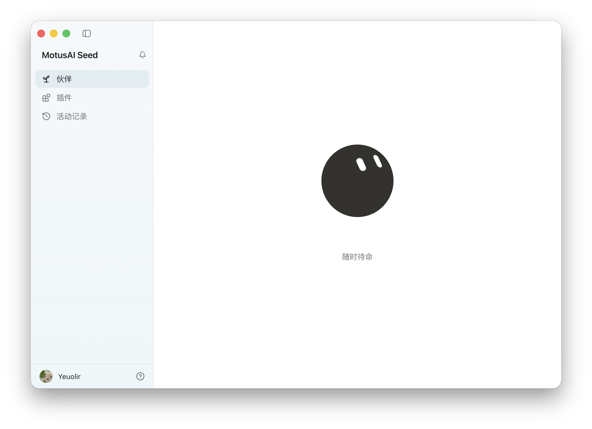
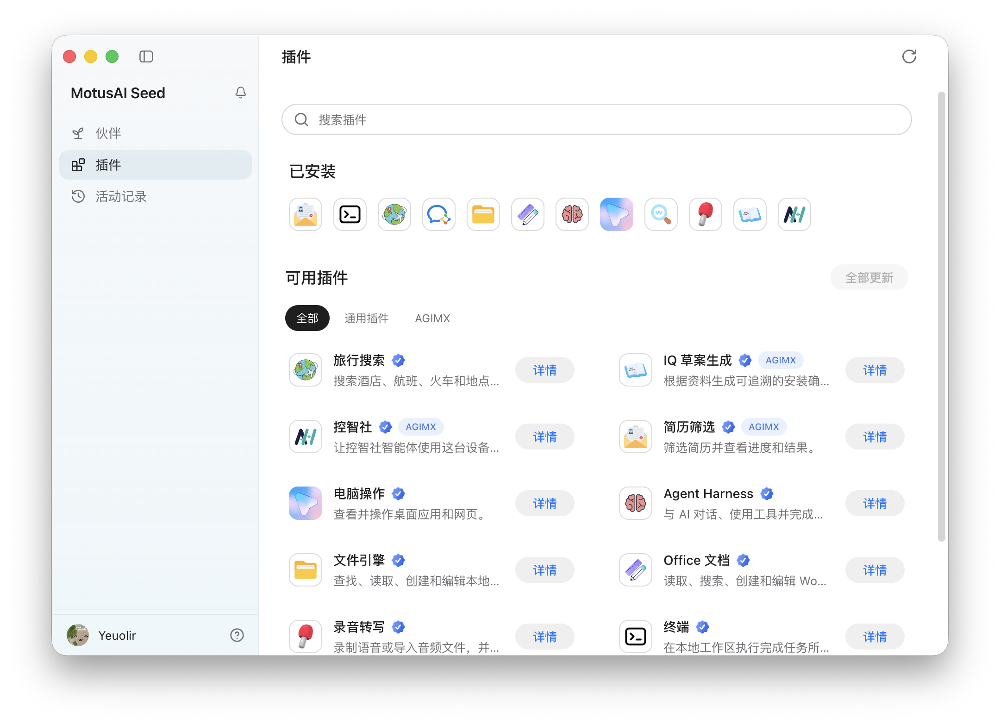
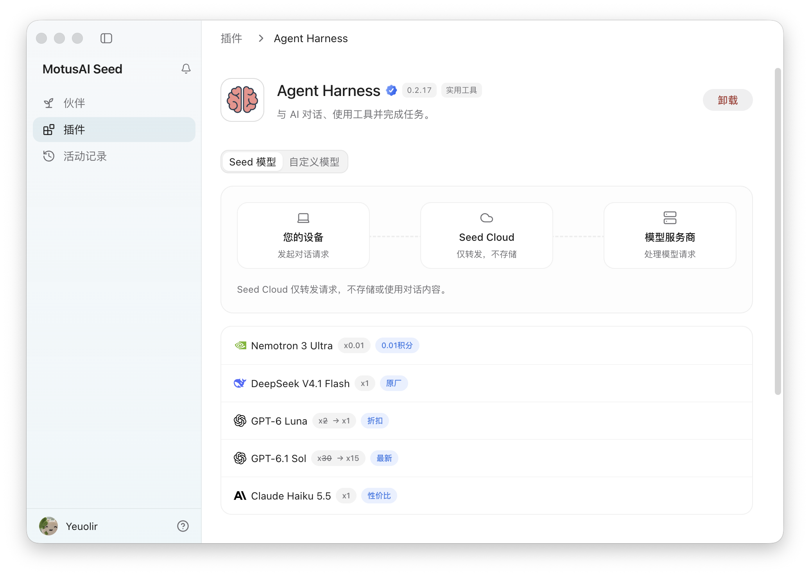

<div align="center">
  
  <h1>MotusAI Seed</h1>
  <p>一个桌面客户端，按需安装插件，让本地能力安全协作。</p>
  <p>
    <a href="https://motusseed.com">官方网站</a> ·
    <a href="https://cloud.motusseed.com/download/mac">下载 macOS 版本</a> ·
    <a href="https://cloud.motusseed.com/download/windows">下载 Windows 版本</a> ·
    <a href="./docs/插件开发手册.md">开发插件</a>
  </p>
</div>



## 认识 Seed

MotusAI Seed 是可扩展的桌面插件客户端。登录 Seed Cloud 后，你可以按需安装插件，把 AI 对话与本机文件、应用和系统能力连接起来。

- **按需扩展**：从插件目录选择所需能力，插件可以独立安装与更新。
- **本地执行**：本机能力在 Seed 管理的隔离环境中运行。
- **权限可控**：敏感操作经过授权，并保留可审计的活动记录。
- **开放开发**：使用公开 SDK 开发插件，由 Seed 提供生命周期、界面和安全边界。

<table>
  <tr>
    <td width="50%"></td>
    <td width="50%"></td>
  </tr>
  <tr>
    <td align="center">按需发现和安装插件</td>
    <td align="center">由插件提供模型与工作能力</td>
  </tr>
</table>

## 开始使用

1. 安装适用于当前平台的 Seed 客户端。
2. 使用 Seed Cloud 账号登录。
3. 在插件目录中安装需要的插件。
4. 回到伙伴首页，开始使用对应能力。

> Seed 仍在持续开发中，界面与插件接口可能随版本调整。

## 开发插件

Seed 是通用插件宿主，具体能力和界面由插件声明。开始开发前，请阅读：

- [插件开发手册](./docs/插件开发手册.md)
- [Seed SDK](./packages/seed-sdk/README.md)
- [社区插件与插件包规范](./docs/社区插件与插件包规范.md)
- [插件架构与安全边界](./docs/插件架构与安全边界.md)

## 本地开发

```bash
cp .env.example .env
npm install
npm run dev
```

提交修改前运行：

```bash
npm run typecheck
npm test
npm run build
```

应用更新与打包要求见[应用更新文档](./docs/应用更新.md)。

使用中遇到问题，请通过 [GitHub Issues](https://github.com/agimx-ai/motusai-seed/issues) 反馈。
